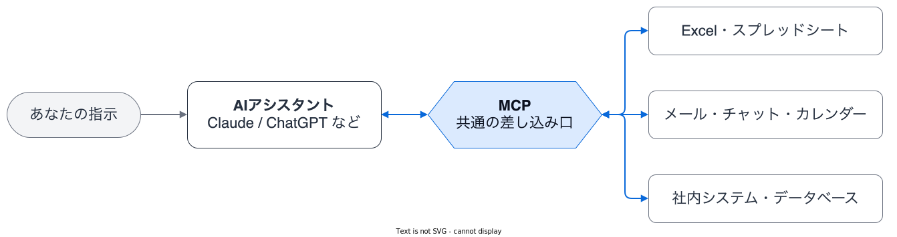
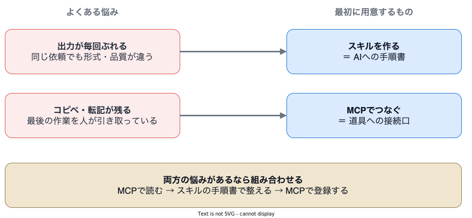

<!-- _class: lead cover -->
<!-- _paginate: false -->

スライド | 株式会社ZENSHIN

# スキルとMCP入門

## その場限りのプロンプトから、再現できる仕組みへ

作成日 2026.07.19

高橋 俊 CTO / 技術責任者

---

<!-- _class: center -->

# 結論から

- 「毎回結果がぶれる」「コピペが残る」は、プロンプトの上手下手ではなく**仕組みの問題**
- 手順と品質をそろえたいなら**スキル** — AIに渡す手順書
- 外部のデータ・システムと直接やり取りするなら**MCP** — AIと道具の接続口
- どちらも特定AI専用ではない**共通規格** — モデルを乗り換えても資産が残る

> 次の一歩はプロンプトの言い回しより***仕組み化***

---

<!-- _class: divider -->
<!-- header: "" -->

# チャット利用の壁

1. **チャット利用の壁**
2. スキル — AIへの手順書
3. MCP — AIと道具の接続口
4. 使い分けと組み合わせ
5. 将来も残る共通規格

---

<!-- header: 1. チャット利用の壁 -->

# AI活用でよくある2つの壁

ChatGPT・Claudeを使い始めた方から、この2つの相談が最も多く届きます。

### 🌀 同じ頼み方でも、毎回結果がぶれる

- 先週うまくいった依頼が、今週は違う形式・違う品質で返ってくる
- 頼む人によっても結果が変わり、そのたびに手直しが発生する

### ✂️ AIの外で、コピペ作業が残る

- 元データを毎回チャットへ貼り付けるところから作業が始まる
- AIの回答をExcelへ貼り、Excelからシステムへ転記して仕事が終わる

---

<!-- _class: detail-list -->

# 毎回「初日の新人」に頼んでいる状態

優秀なAIがなぜ安定しないのかを、新しく来たスタッフに例えて整理します。

- **📋 手順書を渡していない**
  - 毎回口頭（プロンプト）で説明するため、伝え方次第で結果が変わる
- **🔌 社内の道具に触れさせていない**
  - Excelやシステムにアクセスできず、最後の作業は人が引き取る
- **🧠 教えたことが翌日に残らない**
  - チャットを閉じると説明した内容が消え、また最初からやり直しになる

> 足りないのはAIの能力ではなく***手順書と道具の接続***

---

<!-- _class: divider -->
<!-- header: "" -->

# スキル — AIへの手順書

1. チャット利用の壁
2. **スキル — AIへの手順書**
3. MCP — AIと道具の接続口
4. 使い分けと組み合わせ
5. 将来も残る共通規格

---

<!-- header: 2. スキル — AIへの手順書 -->
<!-- _class: detail-list -->

# スキルとは — AIに渡す手順書

スキルの正体は、AIが必要なときに読む小さなマニュアルファイルです。

- **📄 実体はテキストの手順書**
  - 「この仕事はこの手順・この形式で」と書いたファイル（SKILL.md）
- **🎯 必要なときだけAIが読む**
  - 依頼内容に合うスキルをAIが自分で選んで参照する
- **📦 一度作れば使い回せる**
  - チームに配れば、誰がいつ頼んでも同じ手順で動く
- **🛠️ プログラミングは不要**
  - 日本語の文章で書けるため、業務を知る人がそのまま作れる

---

# プロンプトだけとスキルの差

毎週の報告書作成を例に、同じ依頼がどう変わるかを比べます。

### プロンプトだけの場合

- 毎回長い指示文を書き直すか、探して貼り直す
- 書き方が少し違うだけで構成や形式がぶれる
- 上手な人と初めての人で結果に差が出る

### スキルがある場合

- 「週報を作って」の一言で手順書どおりに動く
- 形式・トーン・チェック項目が毎回そろう
- チームの誰が頼んでも同じ品質になる

> 名人の頼み方を***チームの手順書***に変える

---

<!-- _class: detail-list -->

# スキル化に向く仕事の例

「毎回同じ型でやってほしい仕事」がスキル化の第一候補です。

- **📊 週次レポート・議事録の整形**
  - 決まった構成・見出し・トーンで毎回出力させる
- **🧾 見積書・請求書のチェック**
  - 自社のチェック観点を漏れなく同じ順番で確認させる
- **✍️ 提案書・ブログの下書き**
  - 会社の文体・禁止表現・体裁ルールを守らせる
- **📮 問い合わせメールの分類・返信案**
  - 分類基準と返信テンプレートを固定する

---

<!-- _class: table-followup -->

# ファインチューニングとの違い

「AIに業務を覚えさせるには学習が必要では？」という質問に答えます。

| 比較軸 | ファインチューニング | スキル |
| --- | --- | --- |
| やること | AIモデル自体を追加学習させる | AIに手順書を読ませる |
| 必要なもの | 大量の学習データ・専門人材 | 日本語の文章だけ |
| 反映までの時間 | 学習と検証に数週間 | 書いたその場で使える |
| 直したいとき | 再学習が必要 | ファイルを直すだけ |

- 業務の「型をそろえたい」ニーズの大半は、学習なしのスキルで足りる
- 学習させない仕組みなので、間違いに気づいたらすぐ手順を直して反映できる

---

<!-- _class: divider -->
<!-- header: "" -->

# MCP — AIと道具の接続口

1. チャット利用の壁
2. スキル — AIへの手順書
3. **MCP — AIと道具の接続口**
4. 使い分けと組み合わせ
5. 将来も残る共通規格

---

<!-- header: 3. MCP — AIと道具の接続口 -->

# MCPとは — AIと道具をつなぐ接続口

MCPは、AIが外部のデータやシステムを直接読み書きするための接続規格です。

USB-Cのように「共通の差し込み口」を決めた規格。対応サービスなら、どれも同じ方法でAIとつながる。

---

# Excel転記の作業はこう変わる

「AIの回答をコピーしてシステムへ登録」という例で、MCPの効果を見ます。

### MCPなし — 人がデータを運ぶ

- 元データをコピーしてチャットへ貼る
- AIの回答をExcelへ貼り直す
- Excelを見ながらシステムへ手入力する

### MCPあり — AIが道具を直接使う

- AIが元のExcelを自分で読みに行く
- 整理した結果をそのままシステムへ登録する
- 人は最後に内容を確認して承認するだけ

> 人がAIの手足になるのをやめ***AIに道具を持たせる***

---

<!-- _class: detail-list -->

# 身近なMCP対応サービスの例

主要なビジネスツールは、すでにMCPでの接続口を公開し始めています。

- **📁 ドキュメント・ノート**
  - Notion、Google Drive、Box など
- **💬 コミュニケーション**
  - Slack、Gmail、カレンダー など
- **🧑‍💼 業務SaaS**
  - 会議AI（議事録）、CRM、会計 など
- **🏢 自社システム**
  - 接続口を用意すれば、社内DBや基幹システムにも広げられる

対応状況・接続方法は各サービスの公式情報で確認する（2026年7月19日時点）。

---

<!-- _class: detail-list -->

# 社内データとつなぐときの安全性

個人情報を扱う社内システムとの接続で、よく質問される点を整理します。

- **🗝️ 鍵はアクセス権の設計**
  - 「誰がどのデータを見られるか」はAI接続以前からのデータ設計の問題
- **📜 操作の記録を残せる**
  - MCP経由の接続なら「誰が何にアクセスしたか」のログを取れる
- **🚫 学習に使わせない設定**
  - ChatGPT・Claudeとも、入力内容を学習に使わないよう設定できる
- **🧑‍🏫 最後は入力する人の運用**
  - 何を貼ってよいかのルールと教育は、どんな仕組みでも変わらず必要

> セキュリティの鍵はAI以前からの***データ設計とアクセス権***

---

<!-- _class: divider -->
<!-- header: "" -->

# 使い分けと組み合わせ

1. チャット利用の壁
2. スキル — AIへの手順書
3. MCP — AIと道具の接続口
4. **使い分けと組み合わせ**
5. 将来も残る共通規格

---

<!-- header: 4. 使い分けと組み合わせ -->

# スキルかMCPかをこう選ぶ

いまの悩みがどちらのタイプかで、最初に用意するものを決めます。

---

<!-- _class: table-followup -->

# スキルとMCPの比較

2つは競合ではなく、解決する問題が異なる別々の部品です。

| 比較軸 | スキル | MCP |
| --- | --- | --- |
| 例えると | 仕事の手順書 | 道具への差し込み口 |
| 解決する悩み | 出力が毎回ぶれる | コピペ・転記が残る |
| 実体 | 手順を書いたファイル | システム同士の接続規格 |
| 用意する人 | 業務を知る人が文章で書く | 提供側が用意し、利用者は接続設定 |

- どちらか一方を選ぶものではなく、悩みに合わせて足していく
- 利用者の目線では「スキルは自分で書ける・MCPはつなぐだけ」

---

<!-- _class: detail-list -->

# 組み合わせの例 — 転記業務の自動化

冒頭の「Excelコピペ問題」は、2つを組み合わせると仕組みになります。

- **📥 MCPで元データを読む**
  - AIが共有フォルダのExcelを直接開く
- **📋 スキルの手順書どおりに整える**
  - 変換ルール・チェック観点・除外条件を毎回同じに適用する
- **📤 MCPでシステムへ登録する**
  - 結果を直接登録し、人は最終確認だけを行う

この形になると「人が繰り返す作業」が「AIが繰り返す仕組み」に変わり、担当者は確認と例外対応に集中できる。

---

<!-- _class: divider -->
<!-- header: "" -->

# 将来も残る共通規格

1. チャット利用の壁
2. スキル — AIへの手順書
3. MCP — AIと道具の接続口
4. 使い分けと組み合わせ
5. **将来も残る共通規格**

---

<!-- header: 5. 将来も残る共通規格 -->

# どちらもオープンな共通規格

スキルもMCPも、特定のAI製品だけが使える独自機能ではありません。

### 🔌 MCP — 業界標準になった接続規格

- 2024年にAnthropic（Claude開発元）が公開し、ChatGPT・Codex・Geminiも対応
- 2025年末に中立団体（Linux Foundation傘下）へ移管され、OpenAI・Google・Microsoft・Amazonなどが運営に参画

### 📄 スキル — 共通の手順書形式

- SKILL.mdという公開された形式で、同じファイルが複数のAIツールでそのまま動く
- Claude、Codex（OpenAI）、Gemini CLI、GitHub Copilotなど対応ツールが拡大中

各社の対応状況は2026年7月19日に公式情報で確認。

---

<!-- _class: center -->

# モデルが進化しても資産は残る

- 今後も各社から、より賢いモデルが**出続ける**
- スキル（手順書）とMCP（接続）は共通規格なので、**AIを乗り換えても持ち運べる**
- 「どのAIを使うか」は選び直せる — 「自社の仕事をAIに教えた資産」は残り続ける

> 特定のAIにではなく***仕組みに投資***する

---

<!-- _class: center -->
<!-- header: "" -->

# まとめ

1. 「結果がぶれる」「コピペが残る」は、プロンプトではなく**仕組み**で解決する
2. 手順と品質をそろえたいなら**スキル** — AIへの手順書
3. データ・システムと直接やり取りするなら**MCP** — AIと道具の接続口
4. 迷ったら「型の悩みか、接続の悩みか」で選び、必要なら**組み合わせる**
5. どちらも共通規格なので、モデルを乗り換えても**資産が残る**

> 次の一歩はプロンプト磨きより***スキルとMCPの仕組み化***

---

# 主要出典・関連リンク

共通規格に関する記述は、次の公式資料で確認しました。

- [Anthropic — Donating the Model Context Protocol](https://www.anthropic.com/news/donating-the-model-context-protocol-and-establishing-of-the-agentic-ai-foundation)
- [Linux Foundation — Agentic AI Foundation の発足](https://www.linuxfoundation.org/press/linux-foundation-announces-the-formation-of-the-agentic-ai-foundation)
- [OpenAI — MCP and Connectors](https://developers.openai.com/api/docs/guides/tools-connectors-mcp)
- [Agent Skills 公式サイト — 対応ツール一覧](https://agentskills.io/)
- [ZENSHIN — AI相談サービス](https://www.zenshin-inc.co.jp/services/ai-consultation/)

各社の機能・対応状況は2026年7月19日に確認。最新の状況は各公式資料を参照する。

---

<!-- _class: lead contact -->
<!-- _paginate: false -->

# ありがとうございました

ご質問は、以下のいずれかからお気軽にお寄せください。

<a href="https://www.zenshin-inc.co.jp/contact">公式ホームページのお問い合わせ<strong>www.zenshin-inc.co.jp/contact</strong></a>
<a href="https://x.com/suguru_takaha4">ZENSHIN CTO 高橋 俊へのご質問<strong>X @suguru_takaha4</strong><small>DMまたはリプライ</small></a>

<a class="contact-home" href="https://www.zenshin-inc.co.jp/">ZENSHINホームページ<strong>www.zenshin-inc.co.jp</strong></a>

